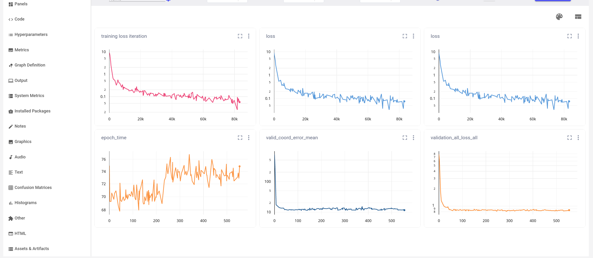

# Logging
LannU-Net uses [comet.ml](https://www.comet.com/site/) for logging. This is a great cloud-based tool that logs data during training and you can access it online. 

### How to Use Comet.ml
First, you must sign up to comet.ml. Then:

1) Sign up to [comet.ml](https://www.comet.com/site/).
2) Set OUTPUT.USE_COMETML_LOGGING = True
3) Override the yaml file OUTPUT.COMET_API_KEY with the key tied to you comet.ml account.
4) Done!

*Optionally*:
   1) Customize OUTPUT.COMET_WORKSPACE to some string.
   2) Customize OUTPUT.COMET_PROJECT_NAME to some string.

For full explanation of comet.ml logging config options, see the [OUTPUT config documentation](advanced_yaml_config.md#output).

Every time you run the main.py file, it generates an experiment you can track online. The URL to find the experiment is printed on the terminal, or you can find it saved in a .txt file in the OUTPUT.OUTPUT_DIR file, in a file named with the timestamp of when you run the code. 

It saves a graph of your model, tracks your training loss, validation loss as well as the validation set coordinate error. It saves the configuration file too so you can reproduce your results. 

It also supports writing your own HTML which you can use to save results or any other data you want. Here is an example of writing a table of results to comet.ml. This is saved after inference. 

You can also use it to check your GPU utilization and memory usage throughtout training!
